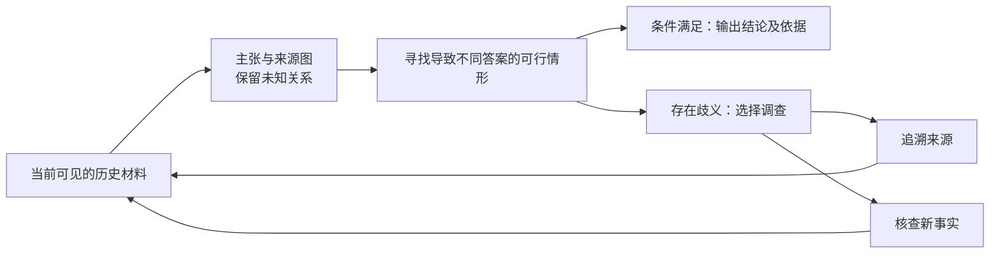

**研究提案｜证据何时足够：来源关系不确定时的主动调查与结论可辨识性**

工作标题：*Investigate Before You Believe: Active Evidence Acquisition under Uncertain Provenance*

后续讨论补充：[让假设随证据演化，并能够从早期误导中恢复](02-动态多假设进化.md)。该补充把持续候选维护、证据修订与恢复纳入方法设计，沿用本提案的时间隔离与可辨识性边界。

**研究问题**

任务定义为：面对真假混杂、互相转述的材料，系统判断某个结论是否已经由证据确定；若尚未确定，选择最有价值的一次调查。调查既可以核查事实，也可以追溯消息来自哪次原始观察。系统应能保留未查清的细节，在足以回答目标问题时停止。

具体研究对象是：**来源继承关系本身不完整时，联合决定“查事实”与“查出处”，并用可审核的证据条件控制何时下结论。**来源依赖、可能世界、主动信息获取和鲁棒认证分别已有深厚研究；本提案的创新必须由这个具体缺口上的算法和真实数据结果来建立。

“人物—人物、人物—事件、事件—事件图 + GNN 检测矛盾”可以提供基础表示，但尚不足以形成有辨识度的核心贡献。发现两句话矛盾，只能说明不能同时采信；还不能判断哪句话错误。实体图也不能把一句“某媒体声称 A 参与事件 B”直接变成事实边 `A 参与 B`。

**一个贯穿论文的例子**

调查问题是“截至昨日，某工厂是否已经停产”。二十篇报道都说停产，其中十九篇转述同一条匿名消息。它们可能只有一个原始观察来源。此时继续检索转述，未必增加识别真相的能力。

调查者有两个候选动作：追溯两篇报道，查明它们是否实际来自不同的现场观察；或者查找另一条生产记录。后一条记录也可能不完整、错误、仍然转述原消息，不能事先当作可靠答案。

一个合格系统可以输出：“现有材料同时兼容‘确已停产’和‘原消息错误’。下一步应核查某条独立记录；目前继续阅读同源报道不能排除后一种解释。”满足明确假设后，也可以输出：“允许至多一个原始观察来源错误时，该结论仍成立。”

这里的保证依赖来源归属、语义抽取、约束及错误预算。它不是现实世界绝对正确性的保证。不同媒体、不同网址、不同措辞都不能单独证明观察来源独立；不同根源也不自动意味着统计独立。

**文献已经做到哪里**

| 近邻 | 已有贡献 | 本提案必须额外解决的内容 |
|---|---|---|
| Dong et al., *Integrating Conflicting Data: The Role of Source Dependence*, PVLDB 2009 [1] | 从观察数据推断未知复制关系，联合推断真值、来源质量；也讨论复制者提供新信息 | 不能把“未知来源依赖”或“混合复制与新观察”本身当新问题；需要主动获取来源信息的决策及目标结论的停止条件 |
| Arenas et al., *Consistent Query Answers in Inconsistent Databases*, PODS 1999 [2]；Singleton & Booth, *Truth-tracking with Non-expert Information Sources*, JAIR 2024 [3] | 数据修复上的一致答案；错误或不一致报告下可以学到什么 | 不能声称首次研究“不同解释下仍然成立的结论”或“不可辨识性” |
| Golovin et al., EC₂ [4]；Chen et al., ECED [5] | 根据候选解释选择有成本的测试；处理相关性与噪声，并给出特定条件下的理论保证 | 不能把“优先区分候选世界”或“信息增益选查询”当创新。需要处理隐式、未完全确定的来源结构与有界错误，且优于合理适配后的经典方法 |
| *Certifiably Robust RAG against Retrieval Corruption* / RobustRAG [6]；PRA-RAG, Findings ACL 2026 [7] | 检索污染下的鲁棒生成及认证；PRA-RAG 提供聚合表示偏移界 | 需要面向当前证据、来源关系和目标结论的调查停止条件。不能泛称“首次可认证 RAG” |
| CONFACT, IJCAI 2025 [8]；CoVer, arXiv 2026 [9] | 冲突证据下的事实核查；CoVer 包含冲突核查和优先级任务 | 超出固定材料的标签判定，研究调查动作如何改变结论的可辨识性 |
| Forecast-Dojo [10]；*The Corroboration Illusion* [11]，均为 2026 年预印本 | 历史新闻回放与受限检索；相关报道造成的虚假佐证及防御问题 | 时间冻结、真假新闻混合、发现“更多新闻可能更差”均不能单独作为新意 |

来源关系未知本身同样不是新意：[1] 的引言已经明确指出“不知道来源如何获得数据”，并考虑复制者也可能独立提供部分数据。本提案应把真正待验证的增量落到调查动作、当前证据下的可辨识性与计算可行性，不能靠重新命名旧设定建立新颖性。

RobustRAG 的一个具体边界值得区分：原文 IV-D 的认证评估使用 benign passages 与 reference answer；它同时有可部署的推理算法，不能把两者混为一谈。本提案希望在推理阶段、不知道答案时，根据已建模的证据条件报告可辨识性。数据库的一致查询回答早就具有相关思想，因此这个区别本身仍不足以宣称首创。

EC₂ 是尤其重要的挑战：足够大的已知联合状态空间可以把许多新任务编码进去。不能仅靠增加一个隐藏变量就宣称新问题。可能成立的方法贡献在于：不枚举完整来源图与世界空间，在缺少正确先验和完整依赖模型时，仍能高效选择调查并保留明确的条件性保证。尚需检索更专门的鲁棒主动诊断、数据库 provenance/resilience 和溯源查询文献。

**表示与任务接口**

把图分为相互关联的三层：

| 层 | 节点与边 | 用途 |
|---|---|---|
| 实体与事件 | 人物、组织、物品、事件、时间；参与、发生、先后等候选关系 | 表示要回答的问题及其多跳关系 |
| 主张与观察 | 带时间、否定、范围和限定条件的主张；支持、反驳、约束关系 | 保留“被声称的事实”，避免把输入直接当真 |
| 来源与传播 | 文档、原始观察、引用、改写、转载、混合取材关系 | 区分报道数量与证据来源；显式保留未知关系 |

来源分组最好以某条主张的观察根源为单位。一个媒体可以在事件 A 中转载，在事件 B 中独立调查；同一文档也可能同时包含复制内容与新观察。第一版可采用单根模型验证，后续再检验混合来源是否带来实质难度，不能一开始就假定一个网站对应一个固定、独立来源。

图构建器只能读取已获得的材料。不能预先从隐藏文档、未来裁决或完整答案图中提取“关键节点”，再让查询策略免费使用。

**一个可执行的形式化起点**

先限制为有限事实变量和可检查的时序/关系约束。令 `H` 为明确声明的约束，`G(E)` 为当前材料允许的来源结构集合，`R_g` 为结构 `g` 下的原始观察组，`φ_r` 为组 `r` 提供的事实约束。允许至多 `k` 个观察组提供错误内容：

\[
\mathcal W_k(E)=\{(w,g,B):g\in\mathcal G(E),\ B\subseteq R_g,\ |B|\le k,\ w\models H,\ \forall r\notin B,\ w\models\phi_r\}.
\]

\[
\mathcal Y_k(q,E)=\{f_q(w):(w,g,B)\in\mathcal W_k(E)\}.
\]

系统需要区分四种情况：

1. 可行世界非空且只有一个答案：在声明的模型和预算下可辨识。
2. 找到导致不同答案的两个可行世界：仍有歧义，返回可审核的反例。
3. 世界集合为空：约束、来源结构或错误预算不相容，不能利用逻辑上的空集推出任意答案。
4. 求解超时或近似搜索没找到反例：计算上尚未确定，不能冒充已证明唯一。

已知来源结构时，可计算使答案 `y` 不再成立所需的最少失效来源组数：

\[
\rho_y(E,g)=\min_{w\models H,\ f_q(w)\ne y}\sum_{r\in R_g}\mathbf 1[w\not\models\phi_r].
\]

未知结构时对允许的 `g` 再取最小值。只有确认至少存在一个可行世界，且 `ρ_y > k`，才报告该预算下的结论。普通多跳逻辑上的这个优化未必等同于图最小割；一般情况可以很难。先用分组 MaxSAT/约束求解作精确参照，不应随意声称一个最大流算法即可解决。

上述形式化大量继承已有一致回答、模型诊断和鲁棒推断思想，是问题定义与检验接口，不应直接列成新定理。`k` 也不能凭模型的自信选定；应报告多个预算下的结果及敏感性。把根源错误数量限制解释为条件，不需要额外假装所有根源在统计上独立。

**方法路线：围绕反例选择调查**

一个值得试验的算法框架是维护少量使结论不同的候选情形，通过求解器不断寻找尚未排除的反例。根据这些反例，生成两类动作：核查分歧事实，或核查导致分歧的来源继承关系。选择时同时考虑成本、可能返回的新信息、同源重复和查询失败。

GNN 可以做来源关系候选评分、跨事件共享结构特征和调查动作排序。认证部分交给可检查的约束系统。GNN 给一个节点打高分不构成证据；学习到的图若遗漏了真实来源关系，也会破坏条件性保证，应单独量化。

未知事实、来源关系和回答噪声会形成很大的隐式状态空间。可以研究求解器引导的候选扩展与图学习结合，减少每次调查需要显式维护的状态。是否能优于经典近似和更简单的启发式，要由实验决定。

“最大化信息增益”不能自动推出最优性或自适应次模性。新查询可能拿不到材料、得到冲突材料或再次命中同一个根源。最坏情况下若所有动作都可能没有信息，就无法保证最终辨识；应明确可观测性条件，而不是隐藏这个问题。

理论部分若推进，优先研究受限图类中的辨识条件与调查成本界，以及来源结构不确定性如何改变这些界。不要把“增加一份完全相同的副本不应改变答案”这样的直接性质包装成主要理论贡献。

**数据：先做已经发生但当时尚未查清的事实**

第一版优先回答某历史时刻已经存在的状态，例如产品是否涉及某批次召回、某设施是否已经停运、某项组织/供应关系是否已经成立。选择具有后续可审计记录、原始材料与传播链的一个窄领域。正式案例须满足[自建数据集设计约束](../docs/自建数据集设计约束.md)：目标事件在所选模型已核实知识截止日期之后，真假材料占比跨案例变化，图文证据按实际时间逐步公开，并覆盖有机制解释的难例。

“将来是否会停产”属于预测。未来结果受尚未发生的因素影响，应另外评估概率校准与决策损失，不能沿用事实重建的逻辑确定性承诺。

| 时间/材料 | 约束 |
|---|---|
| 模型 | 固定权重和组件版本，核实并记录知识截止日期；目标事件发生时间必须严格晚于该日期。截止日期未知或区间重叠者暂不进入正式主集；同时审计检索及后训练污染 |
| 事件时点 `t_event` | 目标事实已发生或状态已存在 |
| 调查截止 `t0` | 只返回当时实际存在的网页版本、文档与元数据；必须有存档证据，不能只信网页标注日期 |
| 确认时点 `t_resolve > t0` | 后来的审计材料用于标注和评测，与代理可见材料隔离 |
| 检索 | 使用受控快照索引和固定工具接口；搜索摘要、缓存、文件名、跳转页同样不得暴露未来结论 |

“禁止搜答案”应通过检索环境实施。主结果保留真实调查场景；另外设置对直接表述目标结论的材料进行对称过滤的多跳子集，同时过滤肯定和否定答案，公开规则。不能只删除不利于方法的答案页，也不能用事后结局提示问题写法。

训练与测试按事件和时间隔离，补做来源变化评测。来源可信度只能由截止前记录估计。现实标签有争议或尚无法裁决的事件应保留不确定标签，不强行二分类。

**实验设计：把机制与数据难度分开**

需要两部分相互补充：真实历史事件用来回答方法是否有实际价值；具备已知世界、来源结构和合法约束的受控案例，用来检查可辨识性和错误来源。不得把受控改写当作真实世界的因果证据。

配对实验如下。每组应控制文档数、长度、查询预算和表面语气；新增重复材料造成的上下文长度变化另做控制。

| 干预 | 要求观察到的合理行为 |
|---|---|
| 同源消息复制、换写法、换媒体标签 | 不因虚假的来源数量而获得额外认证；准确率和置信度是否受影响是待测问题 |
| 增加真正不同观察根源的证据 | 在条件允许时缩小歧义，不能为了抗重复而对新证据也完全不敏感 |
| 保持主张文本相同，改变来源继承结构 | 系统的可辨识性判断应跟随结构变化；真实世界答案不必因此改变 |
| 只改变一条对目标结论关键的关系，保留其他干扰信息 | 检验是否使用了多跳证据，而非媒体名或语言风格 |
| 隐藏或误标部分来源关系 | 分开测量图已知、图部分已知、图自动抽取三种设置；不把人工完整图优势当端到端成功 |
| 删除真正能区分解释的所有合法材料 | 系统应报告无法确定；评估是否靠过度拒答掩盖一般样本错误 |

核心比较包括：增加推理计算、增加同源报道、增加有用的新观察，对准确率、回答覆盖率和调查成本的影响。分别按真假比例、证据到达轨迹和来源结构分层分析。

主要指标为相同风险下的回答覆盖率、相同覆盖率下的结论错误率，以及达到同等质量所需的总调查成本。成本同时计入检索、读入 token、模型调用、图构建和求解，不只计查询次数。校准和证据引用质量作补充。

模型相对的认证有效性与现实结论正确率应分开报告。自然事件通常没有穷尽的可能世界标签；不能宣称其“不可辨识”金标准已经完备。人工审阅可审核约束、来源和反例，但不等于证明所有现实解释已被列举。

按事件划分并做事件级置信区间。一个事件的一百种改写不能作为一百个独立真实事件。先导数据不够精确估计低错误率时，应明确区间，不以零次错误声称高可靠性。

**必须认真对比的基线**

1. 相同材料与总成本的强 LLM：长上下文推理、常规 RAG、可搜索的调查代理。
2. 语义去重 + 来源信息 + 强 LLM，含简单的查询多样性策略。
3. 考虑来源复制的 truth discovery，与目标问题求解结合。
4. EC₂/ECED 的适配：使用同样估计到的来源/响应模型，另报告完整模型条件下的参照值。
5. 分组 MaxSAT/一致查询回答 + 贪心调查；这是不能省略的简单而强的组合。
6. RobustRAG/PRA-RAG，以及适用的冲突核查方法。来源分组版本也值得补做，避免只击败按文档处理的弱设定。

做同一表示下的组件消融：固定查询与主动查询、只查事实与也查出处、完整来源图与估计图、去掉 GNN、不同错误预算。图结构与 GNN 参数学习的作用分别报告；精确求解、规则和学习方法使用相同输入与总成本口径。

**与候选维护主线的关系**

本路线处理“调查什么、证据何时足够”，可以独立于种群进化研究。其来源记录与去重约束可供 [02 · 动态多假设进化](02-动态多假设进化.md) 和 [03 · 候选恢复](03-图文证据修订与候选恢复.md) 共用；主动调查策略、MaxSAT 认证和理论保证不要求同时加入主系统。

区分表示与学习：来源—主张—事件图是证据记录结构，GNN 是可选的估计器。条件性认证依赖形式化约束和来源假设，不由 GNN 分数或候选池的一致意见产生。

**应检验的机制边界**

| 对照 | 能区分什么 |
|---|---|
| 去重 + 来源信息 + LLM，与主动查出处/事实比较 | 收益是否来自额外调查决策，而非只处理重复材料 |
| 相同来源信息下的 ECED/分组 MaxSAT 等适配 | 新决策机制相对已有推断与调查方法的具体差别 |
| 自动来源图、部分来源图与人工完整图分开 | 图构建误差和图上推理误差，不混作端到端效果 |
| 相同风险下的覆盖率与总成本 | 避免仅靠更多计算或更多拒答取得较低错误率 |

## 参考文献

文献描述限定于引用所依据的正文、摘要或元数据，不推定未经核对的理论性质。

1. Dong, X. L., Berti-Equille, L., & Srivastava, D. (2009). *Integrating Conflicting Data: The Role of Source Dependence*. PVLDB 2(1), 550–561. [DOI](https://doi.org/10.14778/1687627.1687690)；[原文](https://vldb.org/pvldb/vol2/vldb09-pvldb47.pdf)。
2. Arenas, M., Bertossi, L., & Chomicki, J. (1999). *Consistent Query Answers in Inconsistent Databases*. PODS. [DOI](https://doi.org/10.1145/303976.303983)。描述范围限于元数据与摘要。
3. Singleton, J., & Booth, R. (2024). *Truth-tracking with Non-expert Information Sources*. JAIR. [DOI](https://doi.org/10.1613/jair.1.15273)。描述范围限于元数据与摘要，不据此推断完整算法和理论性质。
4. Golovin, D., Krause, A., & Ray, D. (2010). *Near-Optimal Bayesian Active Learning with Noisy Observations*. [arXiv:1010.3091](https://arxiv.org/abs/1010.3091)。相关内容为问题设定与 EC₂ 思路。
5. Chen, Y., Hassani, S. H., & Krause, A. *Near-optimal Bayesian Active Learning with Correlated and Noisy Tests*. [2016 预印本](https://arxiv.org/abs/1605.07334)；[2017 期刊 DOI](https://doi.org/10.1214/17-EJS1336SI)。具体保证有参数已知、条件独立噪声等条件，不能误称覆盖任意相关错误。
6. Xiang, C., Wu, T., Zhong, Z., Wagner, D., Chen, D., & Mittal, P. *Certifiably Robust RAG against Retrieval Corruption*. [arXiv:2405.15556](https://arxiv.org/abs/2405.15556)。定义、分组方式及 §IV-D 表明，分组隔离不等于只能逐文档独立推理。
7. Tan, X., et al. (2026). *PRA-RAG: Provably Robust Aggregation in Retrieval-Augmented Generation against Retrieval Corruption*. Findings of ACL. [官方页面](https://aclanthology.org/2026.findings-acl.1794/)。比较限于方法及偏移界对象，不据此主张其全部理论可迁移。
8. Ge, Z., Wu, Y., Chin, D. W. K., Lee, R. K.-W., & Cao, R. (2025). *Resolving Conflicting Evidence in Automated Fact-Checking: A Study on Retrieval-Augmented LLMs* (CONFACT). [IJCAI 官方页面](https://www.ijcai.org/proceedings/2025/1073)。IJCAI 2025。
9. Zhang, S., et al. (2026). *CoVer: Conflict-Aware Claim Verification*. [arXiv:2609.00508](https://arxiv.org/abs/2609.00508)。预印本。
10. Ye, L., et al. (2026). *Forecast-Dojo*. [arXiv:2609.28876](https://arxiv.org/abs/2609.28876)。预印本。
11. Lu, Y., & Zhang, Y. (2026). *The Corroboration Illusion: When More News Makes LLM Forecasts Less True*. [arXiv:2609.22246](https://arxiv.org/abs/2609.22246)。预印本；全文已明确讨论独立溯源和不确定性感知聚合，故不将这些口号认定为新意。
