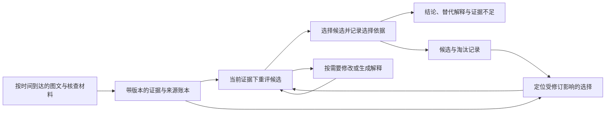

# 候选 IDEA 与系统关系

三个文件是相互关联的研究方向，不是要求整套系统同时实现的三个独立模块。系统可以共用证据表示，论文需要围绕一个具体困难确定主要机制。

| 方向 | 研究对象 | 与主系统的关系 |
|---|---|---|
| [01 · 来源依赖与预算推理](01-来源依赖与预算推理.md) | 下一步查什么、来源是否独立、何时足以回答 | 来源记录可共用；主动调查和条件性认证可单独研究 |
| [02 · 动态多假设进化](02-动态多假设进化.md) | 不可靠图文证据逐步到达时，如何生成、重评和选择解释 | 描述在线候选维护及适应度，是系统的推理过程 |
| [03 · 图文证据修订与候选恢复](03-图文证据修订与候选恢复.md) | 旧证据失效后，如何修正历史选择及淘汰 | 可嵌入 02 的具体机制，也是可单独检验的问题 |

## 最小系统

共同主线可以表述为：**随着真假混合的图文证据逐步公开，维护与当前有效证据相容的解释；当旧依据失效时，修正其评分和选择后果，并允许补入此前遗漏的解释。**

系统共用一个带版本的证据账本，连接主张、图像观测、来源与候选。推理器负责生成/修改解释，评分器提供带依据的支持与冲突评估，选择过程记录保留/淘汰的原因，输出层呈现当前判断、替代解释和不确定性。

图记录依赖，GNN 可以作为边关系或证据相容性的估计器；它不是必须添加的组件。系统也不要求同时具备主动检索策略、求解器认证、GNN 训练和完整遗传算法算子。

## 如何判断是否只是组合

“GNN + LLM + 进化 + RAG”列出的是工具。要研究的机制应落到**不可靠且会变化的适应度如何影响候选淘汰，以及这些影响如何被识别和修正**。写出模块名称或增加一项加权损失，都不能单独确立方法贡献。

需要比较同信息、同容量、同总计算的全量重启、普通多假设维护、来源去重加档案检索、经典 TMS/ATMS 依赖维护，以及适用的序贯推断/动态环境进化方法。需明确各类方法的适用假设和机制边界，不能仅凭局部文献比较断言没有相同方法。

核心对照不仅是删组件，还包括简单组合：已有来源处理加普通档案，是否已经能达到同样结果；只有在修订事件中传播评分变化到历史选择，是否比只更新当前候选或多保留候选更有效。检验标准是结论与依据质量、有效补证后的恢复、伪更正下的稳定性和总成本，并报告方法失败及简单基线占优的条件。

如果合理适配的已有方法已解释全部收益，研究主张应如实归于数据/测量、系统实现或特定条件下的经验结论；不能靠命名把组合改写成新的算法。系统整合可以有应用价值，论文的算法新意需要额外证据。

## 数据与分析接口

自建正式数据遵循[统一设计约束](../docs/自建数据集设计约束.md)：目标事件严格晚于所选模型的已核实知识截止日期；每例真假混合、比例跨案例变化；证据逐步公开；图片提供必要约束；包含明确的 hard cases。已有公开资源和受控开发案例另列，不自动成为符合这些条件的正式测试集。

[附录案例与失败分析规范](../docs/案例与失败分析规范.md)规定如何展示时间线、候选变化、评分变化与错误定位。评价需同时呈现方法成功、失败以及简单基线占优的条件。
